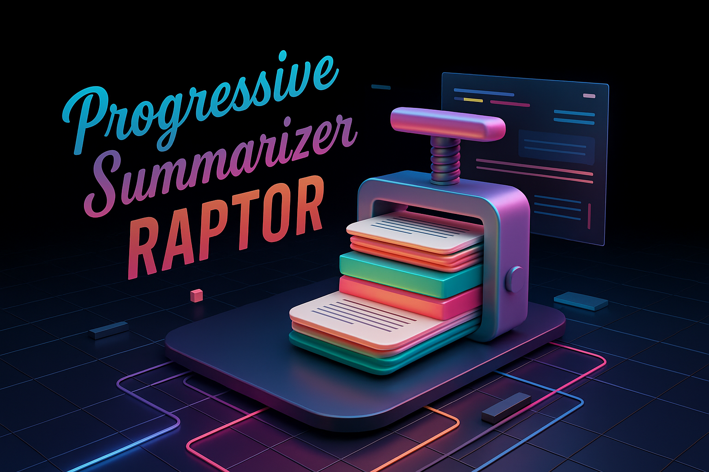

# Progressive Summarizer RAPTOR

Progressive Summarizer RAPTOR (Recursive API for Progressive Text Organization and Refinement) is an advanced text summarization system that creates hierarchical summaries through recursive refinement. It condenses documents while preserving essential information across multiple levels of abstraction, enabling users to navigate between different levels of detail seamlessly.

Based on the paper https://arxiv.org/abs/2401.18059 and the code from https://github.com/run-llama/llama_index/tree/main/llama-index-packs/llama-index-packs-raptor, this innovative solution leverages state-of-the-art embedding models and Large Language Models (LLMs) to understand semantic relationships within text, producing summaries that maintain coherence while achieving significant compression ratios. Unlike traditional single-pass summarization tools, RAPTOR creates a progressive hierarchy where each level provides increasingly condensed versions of the original content.

The system is designed for production environments, offering a robust REST API, Docker support, and intelligent resource management. Whether you're processing research papers, technical documentation, or business reports, RAPTOR provides a scalable solution for extracting key insights at various levels of detail.

## Key Features

- **Recursive Progressive Summarization**: Creates three hierarchical levels of summaries, each more condensed than the previous
- **Semantic Preservation**: Uses sentence transformers to maintain semantic coherence throughout the summarization process
- **LLM Integration**: Seamlessly integrates with Ollama for local LLM deployment
- **GPU Acceleration**: CUDA-enabled for fast embedding generation and processing
- **Intelligent Resource Management**: Optimizes CPU and memory usage based on available system resources
- **Production-Ready API**: FastAPI-based REST interface with automatic documentation and validation
- **Docker Integration**: Easy deployment with Docker and docker-compose for both CPU and GPU environments
- **Configurable Processing**: Adjustable parameters for summarization depth, model selection, and processing options
- **Model Caching**: Efficient model management with lifespan context managers for improved performance
- **Comprehensive Logging**: Detailed logging with rotating file handlers for debugging and monitoring
- **Thread-Safe Processing**: Concurrent processing capabilities with proper resource management

## Table of Contents

- [How the Summarization Algorithm Works](#how-the-summarization-algorithm-works)
  - [The Pipeline](#the-pipeline)
  - [Recursive Refinement Process](#recursive-refinement-process)
  - [Semantic Understanding Through Embeddings](#semantic-understanding-through-embeddings)
  - [Comparison with Traditional Summarization](#comparison-with-traditional-summarization)
- [Advantages of the Solution](#advantages-of-the-solution)
  - [Information Hierarchy](#information-hierarchy)
  - [Superior Performance](#superior-performance)
  - [Flexibility and Customization](#flexibility-and-customization)
- [Installation and Deployment](#installation-and-deployment)
  - [Prerequisites](#prerequisites)
  - [Getting the Code](#getting-the-code)
  - [Local Installation with Uvicorn](#local-installation-with-uvicorn)
  - [Docker Deployment (Recommended)](#docker-deployment-recommended)
  - [Ollama Setup](#ollama-setup)
- [Using the API](#using-the-api)
  - [API Endpoints](#api-endpoints)
  - [Example API Call](#example-api-call)
  - [Response Format](#response-format)
- [Configuration](#configuration)
- [Custom Prompt Templates](#custom-prompt-templates)
  - [Default Prompt Template](#default-prompt-template)
- [Contributing](#contributing)

## How the Summarization Algorithm Works

### The Pipeline

RAPTOR implements a sophisticated multi-stage pipeline that combines embedding-based semantic analysis with LLM-powered text generation:

1. **Input Processing**: The API accepts JSON documents containing text chunks to be summarized through the `/raptor/` endpoint
2. **Embedding Generation**: Each text segment is converted into high-dimensional vector representations using sentence transformers (configurable via `embedder_model` parameter)
3. **Semantic Clustering (Level 1)**: The system performs dimensionality reduction and clustering to group semantically related segments
4. **Initial Summarization**: First-level summaries are generated for each cluster using carefully crafted prompts sent to the LLM (configurable via `llm_model` and `temperature` parameters)
5. **Recursive Clustering (Level 2)**: Level 1 summaries undergo a second round of embedding and clustering to identify higher-level relationships
6. **Intermediate Summarization**: Second-level summaries are generated from the Level 2 clusters
7. **Final Consolidation (Level 3)**: All Level 2 summaries are combined and processed to create a comprehensive final summary
8. **Token Optimization**: Summaries at each level can be optimized to stay within token limits (configurable via `threshold_tokens` parameter)
9. **Hierarchical Output**: The system returns all three levels of summaries with detailed metadata including processing time and reduction ratios

### Hierarchical Clustering and Summarization Process

The core innovation of RAPTOR lies in its hierarchical clustering and multi-level summarization approach:

```python
# Conceptual representation of the RAPTOR process
def raptor_process(chunks):
    # Level 1: Initial clustering and summarization
    chunks_embedded = get_embeddings(chunks)
    level1_clusters = perform_clustering(chunks_embedded)
    level1_summaries = []
    
    # Generate summaries for each Level 1 cluster
    for cluster in level1_clusters:
        cluster_text = concatenate_cluster_chunks(cluster)
        summary = generate_summary(cluster_text)
        level1_summaries.append(summary)
    
    # Level 2: Cluster the Level 1 summaries
    level1_embedded = get_embeddings(level1_summaries)
    level2_clusters = perform_clustering(level1_embedded)
    level2_summaries = []
    
    # Generate summaries for each Level 2 cluster
    for cluster in level2_clusters:
        cluster_text = concatenate_cluster_chunks(cluster)
        summary = generate_summary(cluster_text)
        level2_summaries.append(summary)
    
    # Level 3: Final consolidation
    final_text = " ".join(level2_summaries)
    final_summary = generate_summary(final_text)
    
    return {
        "level1": level1_summaries,
        "level2": level2_summaries,
        "level3": [final_summary]
    }
```

This approach ensures semantic coherence across multiple levels of abstraction while progressively condensing information. Rather than a simple recursive function, RAPTOR implements a sophisticated pipeline that combines semantic clustering with LLM-powered summarization at each level.

### Semantic Understanding Through Embeddings

RAPTOR leverages transformer-based embedding models to capture semantic meaning:

- **Vector Representations**: Text segments are converted to dense vectors that capture semantic relationships
- **Similarity Measurement**: Cosine similarity between embeddings guides the summarization process
- **Concept Preservation**: Key concepts are identified and preserved across summarization levels
- **Contextual Understanding**: The system maintains contextual relationships between different parts of the text

### Comparison with Traditional Summarization

| Feature | Traditional Summarization | Progressive-Summarizer-RAPTOR |
|---------|---------------------------|-------------------------------|
| Approach | Single-pass extraction or abstraction | Multi-level recursive refinement |
| Detail Levels | One fixed level | Multiple navigable levels |
| Semantic Analysis | Limited or rule-based | Deep embedding-based understanding |
| Context Preservation | Often loses nuanced context | Maintains context through hierarchy |
| Customization | Limited parameters | Highly configurable depth and detail |
| Scalability | Linear complexity | Optimized recursive processing |
| Information Access | All-or-nothing | Progressive zoom in/out capability |

## Advantages of the Solution

### Information Hierarchy

RAPTOR creates a natural information hierarchy that mirrors human understanding:

- **Progressive Detail**: Users can start with high-level overviews and drill down as needed
- **Preserved Structure**: Document structure and logical flow are maintained across levels
- **Contextual Navigation**: Each level provides sufficient context to understand the next
- **Flexible Consumption**: Different stakeholders can access appropriate detail levels

### Superior Performance

The system is optimized for production environments:

- **GPU Acceleration**: Leverages CUDA for fast embedding generation
- **Efficient Caching**: Models are loaded once and reused throughout the application lifecycle
- **Concurrent Processing**: Thread-safe implementation allows parallel document processing
- **Resource Optimization**: Intelligent allocation of CPU cores and memory
- **Scalable Architecture**: Stateless API design enables horizontal scaling

### Flexibility and Customization

RAPTOR adapts to diverse use cases:

- **Model Selection**: Choose from various embedding and LLM models
- **Depth Control**: Configure the number of summarization levels
- **Parameter Tuning**: Adjust temperature, context windows, and other generation parameters
- **Integration Options**: REST API allows integration with any programming language or platform
- **Deployment Flexibility**: Run locally, in containers, or in cloud environments

## Installation and Deployment

### Prerequisites

- Docker and Docker Compose (for Docker deployment)
- NVIDIA GPU with CUDA support (recommended for performance)
- NVIDIA Container Toolkit (for GPU passthrough in Docker)
- Python 3.10 (for local installation)
- Ollama installed and running (for LLM functionality)

### Getting the Code

Before proceeding with any installation method, clone the repository:
```bash
git clone https://github.com/smart-models/Progressive-Summarizer-RAPTOR.git
cd Progressive-Summarizer-RAPTOR
```

### Local Installation with Uvicorn

1. Create a virtual environment:
   ```bash
   python -m venv venv
   source venv/bin/activate  # On Linux/Mac
   ```
   
   **For Windows users:**
   
   * Using Command Prompt:
   ```cmd
   venv\Scripts\activate.bat
   ```
   
   * Using PowerShell:
   ```powershell
   # If you encounter execution policy restrictions, run this once per session:
   Set-ExecutionPolicy -ExecutionPolicy RemoteSigned -Scope Process
   
   # Then activate the virtual environment:
   venv\Scripts\Activate.ps1
   ```

2. Install dependencies:
   ```bash
   pip install -r requirements.txt
   ```

   Note: For GPU support, ensure you have the appropriate PyTorch version installed:
   ```bash
   pip install torch torchvision torchaudio --index-url https://download.pytorch.org/whl/cu121
   ```

3. Run the FastAPI server:
   ```bash
   uvicorn raptor_api:app --reload --host 0.0.0.0 --port 8000
   ```

4. The API will be available at `http://localhost:8000`.
   
   Access the API documentation and interactive testing interface at `http://localhost:8000/docs`.

### Docker Deployment (Recommended)

1. Create required directories for persistent storage:
   ```bash
   # Linux/macOS
   mkdir -p models logs
   
   # Windows CMD
   mkdir models
   mkdir logs
   
   # Windows PowerShell
   New-Item -ItemType Directory -Path models -Force
   New-Item -ItemType Directory -Path logs -Force
   ```

2. Deploy with Docker Compose:

   **CPU-only deployment**:
   ```bash
   cd docker
   docker compose --profile cpu up -d
   ```

   **GPU-accelerated deployment** (requires NVIDIA GPU):
   ```bash
   cd docker
   docker compose --profile gpu up -d
   ```

   **Stopping the service**:
   ```bash
   # To stop CPU deployment
   docker compose --profile cpu down
   
   # To stop GPU deployment
   docker compose --profile gpu down
   ```

3. The API will be available at `http://localhost:8000`.

### Ollama Setup

#### For Docker Deployment

If you're using the Docker deployment method, Ollama is **automatically included** in the docker-compose configuration. The docker-compose.yml file defines an `ollama` service that:

- Uses the official `ollama/ollama:latest` image
- Is configured to work with both CPU and GPU profiles
- Has GPU passthrough enabled when using the GPU profile
- Automatically connects to the RAPTOR service

No additional Ollama setup is required when using Docker deployment.

#### For Local Installation

If you're using the local installation method with Uvicorn, you **must set up Ollama separately** before running RAPTOR:

1. **Install Ollama**:
   ```bash
   # Linux
   curl -fsSL https://ollama.ai/install.sh | sh
   
   # macOS
   brew install ollama
   
   # Windows
   # Download from https://ollama.ai/download
   ```

2. **Start Ollama service**:
   ```bash
   ollama serve
   ```

3. **Pull required model** (default: gemma3:4b):
   ```bash
   ollama pull gemma3:4b
   ```

The RAPTOR API will connect to Ollama at `http://localhost:11434` by default. You can change this by setting the `OLLAMA_BASE_URL` environment variable.

## Using the API

### API Endpoints

- **POST `/raptor/`**  
  Processes a document and generates hierarchical summaries.
  
  **Parameters:**
  - `file`: JSON file containing text chunks to be summarized
  - `llm_model`: LLM model to use for summarization (string, default: "gemma3:4b")
  - `embedder_model`: Model to use for generating embeddings (string, default: "sentence-transformers/all-MiniLM-L6-v2")
  - `threshold_tokens`: Maximum token limit for summaries (integer, optional)
  - `temperature`: Controls randomness in LLM output (float, default: 0.3)
  - `context_window`: Maximum context window size for LLM (integer, default: 18432)
  - `custom_prompt`: Optional custom prompt template for summarization (string, optional)
  
  **Expected JSON Input Format:**
  ```json
  {
    "chunks": [
      {
        "text": "First chunk of text content...",
        "metadata": "Optional metadata"
      },
      {
        "text": "Second chunk of text content...",
        "id": 12345
      }
    ]
  }
  ```

- **GET `/`**  
  Health check endpoint returning service status, GPU availability, API version, and Ollama connectivity status.

### Example API Call

**Using cURL:**
```bash
# Basic usage
curl -X POST "http://localhost:8000/raptor/" \
  -F "file=@document.json" \
  -H "accept: application/json"

# With custom parameters
curl -X POST "http://localhost:8000/raptor/?llm_model=gemma3:4b&temperature=0.2&threshold_tokens=4000" \
  -F "file=@document.json" \
  -H "accept: application/json"
```

**Using Python:**
```python
import requests
import json

# API endpoint
api_url = 'http://localhost:8000/raptor/'
file_path = 'document.json'

# Prepare the document
document = {
    "chunks": [
        {"text": "Your first text chunk here..."},
        {"text": "Your second text chunk here..."}
    ]
}

# Save to file
with open(file_path, 'w') as f:
    json.dump(document, f)

# Make the request
try:
    with open(file_path, 'rb') as f:
        files = {'file': (file_path, f, 'application/json')}
        params = {
            'llm_model': 'gemma3:4b',
            'temperature': 0.3,
            'threshold_tokens': 4000
        }
        
        response = requests.post(api_url, files=files, params=params)
        response.raise_for_status()
        
        result = response.json()
        # Group chunks by cluster level
        level_1_chunks = [chunk for chunk in result['chunks'] if chunk['cluster_level'] == 1]
        level_2_chunks = [chunk for chunk in result['chunks'] if chunk['cluster_level'] == 2]
        level_3_chunks = [chunk for chunk in result['chunks'] if chunk['cluster_level'] == 3]
        
        print(f"Generated summaries at {len(set(chunk['cluster_level'] for chunk in result['chunks']))} levels")
        print(f"Level 1 summaries: {len(level_1_chunks)}")
        print(f"Level 2 summaries: {len(level_2_chunks)}")
        print(f"Level 3 summaries: {len(level_3_chunks)}")
        print(f"Sample level 3 summary: {level_3_chunks[0]['text'][:200]}..." if level_3_chunks else "No level 3 summary available")
        
except Exception as e:
    print(f"Error: {e}")
```

### Response Format

A successful summarization returns a hierarchical structure:

```json
{
  "chunks": [
    {
      "text": "First level summary with moderate compression...",
      "token_count": 2500,
      "cluster_level": 1,
      "id": 1
    },
    {
      "text": "Another first level summary...",
      "token_count": 1800,
      "cluster_level": 1,
      "id": 2
    },
    {
      "text": "Second level summary with higher compression...",
      "token_count": 1200,
      "cluster_level": 2,
      "id": 3
    },
    {
      "text": "Third level summary, highly condensed...",
      "token_count": 600,
      "cluster_level": 3,
      "id": 4
    }
  ],
  "metadata": {
    "input_chunks": 20,
    "level_1_clusters": 5,
    "level_2_clusters": 2,
    "level_3_clusters": 1,
    "total_clusters": 8,
    "reduction_ratio": 0.6,
    "llm_model": "gemma3:4b",
    "embedder_model": "sentence-transformers/all-MiniLM-L6-v2",
    "temperature": 0.3,
    "context_window": 18432,
    "custom_prompt_used": false,
    "processing_time": {
      "total": 45.2,
      "level_1": 20.5,
      "level_2": 15.3,
      "level_3": 9.4
    }
  }
}
```
## Configuration

RAPTOR can be tuned through environment variables (for Docker deployments) or a local `.env` file. The table below lists every variable consumed by the application together with its default value:

| Variable | Description | Default |
|----------|-------------|---------|
| `OLLAMA_BASE_URL` | Base URL of the Ollama API server | `http://localhost:11434` |
| `LLM_MODEL` | Default LLM model used for summarization | `gemma3:4b` |
| `EMBEDDER_MODEL` | Sentence-Transformer model used for embeddings | `sentence-transformers/all-MiniLM-L6-v2` |
| `TEMPERATURE` | Sampling temperature for the LLM | `0.3` |
| `CONTEXT_WINDOW` | Maximum token window supplied to the LLM | `18432` |
| `RANDOM_SEED` | Seed for deterministic operations | `224` |
| `MAX_WORKERS` | Number of worker threads (absolute or percentage) | `75% of CPU cores` |
| `MODEL_CACHE_TIMEOUT` | Seconds before an unused model is evicted from cache | `3600` |
| `LOG_LEVEL` | Logging verbosity (honoured by Docker, Python defaults to INFO) | `INFO` |

`MODEL_CACHE_TIMEOUT` is read directly by the API (`raptor_api.py`, line 517) to control how long a model remains in the on-disk cache. The optional `LOG_LEVEL` variable is evaluated by the Docker start-up script; the Python code sets logging to `INFO` by default.

## Custom Prompt Templates

RAPTOR allows you to customize the summarization behavior by providing your own prompt template through the `custom_prompt` parameter. This gives you fine-grained control over how the LLM generates summaries.

### Default Prompt Template

Below is the default prompt template used by RAPTOR. You can use this as a starting point for creating your own custom prompts:

```python
PROMPT_TEMPLATE = """
    Act as an expert technical writer specializing in creating concise, accurate, and objective summaries.
    Summarize the following text (delimited by lines containing only dashes) according to these guidelines:

    1. CORE REQUIREMENTS:
    - Extract all key facts, arguments, and essential details.
    - Preserve technical terms, numbers, and data points exactly as in the original.
    - Maintain the chronological flow and causal relationships present in the text.
    - Use only information explicitly stated in the text.

    2. FORMATTING:
    - Write as a cohesive narrative using neutral, objective language.
    - Start directly with key information—do not include introductions or meta-references.
    - Use original terminology and maintain technical accuracy.
    - Ensure clarity and readability throughout.

    3. AVOID:
    - Meta-references (e.g., "this text discusses").
    - Personal interpretations or external knowledge.
    - Bullet points or lists.
    - Redundant or repetitive information.
    - Introductory or concluding phrases (e.g., "Here's a concise, objective summary of the provided text").

    If the text is ambiguous or incomplete, summarize only what is clear and explicitly stated.   

    Text:
    ------------------------------------------------------------------------------------------
    <text_to_summarize>
    {}
    </text_to_summarize>
    ------------------------------------------------------------------------------------------

    IMPORTANT:
    - Begin your response immediately with the summary content.
    - Use the same language as the original text.
    """
```

### Important Note When Creating Custom Prompts

When creating your own custom prompt template, you **must** include the placeholder `{}` within `<text_to_summarize>` tags as shown above. This placeholder will be replaced with the actual text to be summarized.

Failure to include the proper placeholder format will cause the summarization process to fail.

## Contributing

Progressive-Summarizer-RAPTOR is an open-source project that welcomes contributions from the community. Your involvement helps make the tool better for everyone.

We value contributions of all kinds:
- Bug fixes and performance improvements
- Documentation enhancements
- New features and capabilities
- Test coverage improvements
- Integration examples and tutorials

If you're interested in contributing:

1. Fork the repository
2. Create a feature branch (`git checkout -b feature/amazing-feature`)
3. Make your changes
4. Add or update tests as appropriate
5. Ensure all tests pass
6. Commit your changes (`git commit -m 'Add amazing feature'`)
7. Push to the branch (`git push origin feature/amazing-feature`)
8. Open a Pull Request

Please ensure your code follows the existing style conventions and includes appropriate documentation.

For major changes, please open an issue first to discuss what you would like to change.

Happy Summarizing with RAPTOR!

---